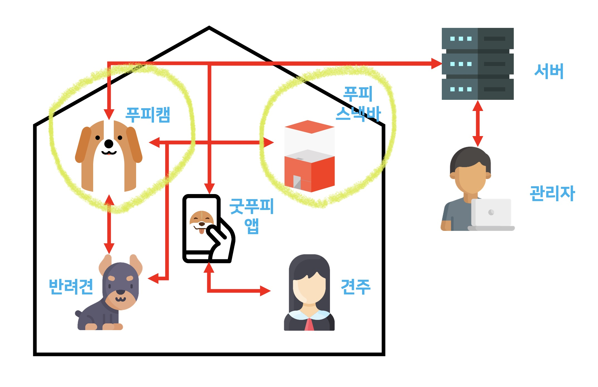

# Embedded Repo

SW Maestro 11기 팀 우릴봐

- 하경민 (팀장)
- 방승연
- 전형준

담당 멘토

- 강진범
- 김윤래
- 박정규
- 오은석
- 최광선

<!-- TABLE OF CONTENTS -->
## Table of Contents

- [Embedded Repo](#embedded-repo)
  - [Table of Contents](#table-of-contents)
  - [About The Project](#about-the-project)
    - [Built With](#built-with)
  - [Getting Started](#getting-started)
    - [Prerequisites](#prerequisites)
    - [Installation](#installation)
  - [Contact](#contact)
    - [팀 우릴봐](#팀-우릴봐)
  - [Acknowledgements](#acknowledgements)

<!-- ABOUT THE PROJECT -->
## About The Project



푸피캠의 라즈베리파이에 들어갈 모듈,
그리고 푸피스낵바의 아두이노에 들어갈 모듈을 개발합니다.

### Built With

- H/W
  - Raspberry Pi 4 Model B Rev 1.4 8GB RAM + 32GB SD Card
  - Coral USB Accelerator
  - YR-029 - Camera kit
  - Arduino Uno Rev3
  - HC-06 - Bluetooth module
  - SG-90 - Servo motor
- S/W
  - Raspbian GNU/Linux 10 (buster)
  - Python 3.7.3
  
<!-- GETTING STARTED -->
## Getting Started

라즈베피 파이와 아두이노에서 어떻게 사용하는지를 설명합니다. 아래의 절차에 따라서 라즈베리 파이와 아두이노를 세팅하고 실행해보세요.

### Prerequisites

- Raspberry Pi Camera Setting

1. 카메라 모듈 설치


2. 라즈베리 파이 설정

아래의 명령어를 입력한 뒤, 5 Interfacing Options → P1 Camera에서 카메라를 활성화한 후, 재부팅을 합니다.

```bash
$ sudo raspi-config
```

3. 카메라 테스트

```bash
$ raspistill -v -o ~/Desktop/test.jpg
```

- USB Accelerator

1. Edge TPU runtime 설치

아래의 명령어를 실행한 뒤 Coral을 연결합니다. 이미 Coral이 연결되어 있는 상태라면 장치를 제거했다가 다시 연결합니다.

```bash
$ echo "deb https://packages.cloud.google.com/apt coral-edgetpu-stable main" | sudo tee /etc/apt/sources.list.d/coral-edgetpu.list
$ curl https://packages.cloud.google.com/apt/doc/apt-key.gpg | sudo apt-key add -
$ sudo apt-get update
$ sudo apt-get install libedgetpu1-std -y
```

2. Tensorflow Lite 라이브러리 설치

설치 후에 [링크1](https://github.com/tensorflow/examples/tree/master/lite/examples/object_detection/raspberry_pi), [링크2](https://github.com/google-coral/tflite/tree/master/python/examples/detection) 등을 참고하여 Tensorflow Lite 라이브러리가 제대로 설치되었는지 확인해보세요.

```bash
$ pip3 install https://dl.google.com/coral/python/tflite_runtime-2.1.0.post1-cp37-cp37m-linux_armv7l.whl
```

3. Edge TPU API 설치

설치 후에 [링크](https://github.com/google-coral/edgetpu/tree/master/examples)를 참고하여 Tensorflow Lite 라이브러리가 제대로 설치되었는지 확인해보세요.

```bash
$ sudo apt-get install python3-edgetpu -y
```

- v4l2loopback

1. raspberrypi-kernel-headers 설치

```bash
$ sudo apt install raspberrypi-kernel-headers -y
$ sudo ln -s /usr/src/linux-headers-5.4.51-v7l+/ /lib/modules/5.4.51-v7l+/build
```

2. v4l2loopback 설치

```bash
$ git clone https://github.com/umlaeute/v4l2loopback
$ cd v4l2loopback
$ make && sudo make install
$ sudo depmod -a
```

3. 가상 비디오 장치 2개 생성

video_nr 옵션을 이용하여 생성하고자 하는 가상 비디오 장치의 번호를 지정합니다.

```bash
$ sudo modprobe v4l2loopback video_nr=2,3
$ ls /dev/video* -al
```

4. v4l2loopback 자동 실행

[링크](https://github.com/umlaeute/v4l2loopback)의 LOAD THE MODULE AT BOOT 부분을 참고하세요

5. 가상 비디오 장치로 영상 미러링

```bash
$ ffmpeg -f v4l2 -s 800x600 -i /dev/video0 -f v4l2 /dev/video2 -f v4l2 /dev/video3
```

- OpenCV
  
1. 파일 시스템 확장

용량 부족 문제를 해소하고자 합니다.

아래의 명령어를 입력한 뒤, 7 Advanced Options → A1 Expand Filesystem을 선택한 후, 재부팅을 합니다.

```bash
$ sudo raspi-config
```

라즈베리 파이가 켜진 뒤 아래의 명령어를 입력하여 확장된 용량을 확인할 수 있습니다.

```bash
$ df -h
```

추가적으로 라즈베리 파이의 용량을 확보하고자 한다면 아래의 명령어를 통해 필요없는 패키지를 삭제하세요.

```bash
$ sudo apt-get purge wolfram-engine
$ sudo apt-get purge libreoffice*
$ sudo apt-get clean
$ sudo apt-get autoremove
```

2. 종속성 패키지 설치

```bash
$ sudo apt-get update && sudo apt-get upgrade
$ sudo apt-get install build-essential cmake pkg-config -y
$ sudo apt-get install libjpeg-dev libtiff5-dev libjasper-dev libpng-dev -y
$ sudo apt-get install libavcodec-dev libavformat-dev libswscale-dev libv4l-dev -y
$ sudo apt-get install libxvidcore-dev libx264-dev -y
$ sudo apt-get install libfontconfig1-dev libcairo2-dev -y
$ sudo apt-get install libgdk-pixbuf2.0-dev libpango1.0-dev -y
$ sudo apt-get install libgtk2.0-dev libgtk-3-dev -y
$ sudo apt-get install libatlas-base-dev gfortran -y
$ sudo apt-get install libhdf5-dev libhdf5-serial-dev libhdf5-103 -y
$ sudo apt-get install libqtgui4 libqtwebkit4 libqt4-test python3-pyqt5 -y
$ sudo apt-get install python3-dev -y
$ pip3 install Pillow
```

3. opencv-contrib-python 설치

```bash
$ pip3 install opencv-contrib-python==4.1.0.25
``` 

### Installation


<!-- CONTACT -->
## Contact

### 팀 우릴봐

- 하경민 (팀장) gaonrudal@gmail.com
- 방승연 baaaang_53@yonsei.ac.kr
- 전형준 chariot0720@gmail.com

<!-- Acknowledgements -->
## Acknowledgements

- [Getting started with picamera](https://projects.raspberrypi.org/en/projects/getting-started-with-picamera)
- [Tensorflow Lite example](https://github.com/tensorflow/examples/tree/master/lite/examples/object_detection/raspberry_pi)
- [Google Coral TensorflowLite example](https://github.com/google-coral/tflite/tree/master/python/examples/detection)
- [Edge TPU API example](https://github.com/google-coral/edgetpu/tree/master/examples)
- [v4l2loopback](https://github.com/umlaeute/v4l2loopback)
- [Install opencv on raspberry pi 4](https://www.pyimagesearch.com/2019/09/16/install-opencv-4-on-raspberry-pi-4-and-raspbian-buster/)